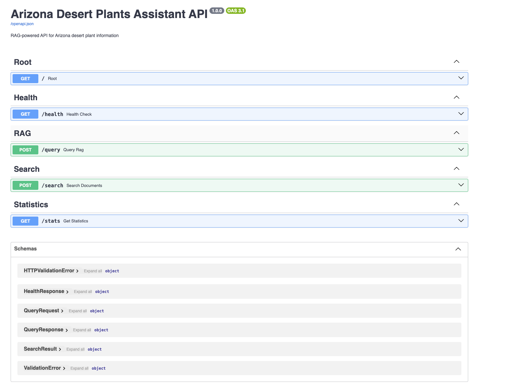

# Using the Arizona Desert Plants Assistant

## Technologies

- Python 3.12
- Docker and Docker Compose
- Qdrant for the vector store
- LLM is OpenAI
- UV for dependency management

## Pre-requisites

1. An OPENAI API key is required:
    - Since we are using OpenAI, it is a good practice to create a new project and key
2. Have Python 3.12 installed
3. Instal UV
    - [Instructions](https://docs.astral.sh/uv/getting-started/installation/) how to install
    - Python can be installed once UV is installed as well

## Project Structure

```
.
├── assistant-app/app.py                      # FastAPI application
├── assistant-app/ArizonaPlantVectorStore.py  # Vector store class
├── assistant-app/ArizonaPlantRAG.py          # RAG class
├── data-ingestion/ingestion.py               # Data ingestion script
├── data-preparation                          # Data preparation and dataset files
├── evaluation                                # Evaluation tooling
├── docker-compose.yml                        # Qdrant setup
├── Dockerfile                                # dockerfile for the assistant app
├── pyproject.toml                            # Python dependencies
├── .env                                      # Environment variables (create from .env.example)
├── .env.example                              # Template for environment variables
└── qdrant_storage/                           # Qdrant data (created by Docker)
```

## Quick Start

### Option A: Run Everything with Docker (Easiest) 🐳

```bash
# 1. Create .env file with your API key
cp .env.example .env
# Edit .env and add your OPENAI_API_KEY

# 2. Build and start everything
docker-compose up --build

# 3. Before starting docker-compose, run ingestion locally
uv sync
uv run python ingest_data.py

# API will be available at http://localhost:8000
# Qdrant UI at http://localhost:6333/dashboard
```

That's it! Both Qdrant and the API are running.

**Note**
You need to wait a few seconds until the logs in the console display this at the end

```bash
arizona-plants-qdrant  | 2025-10-20T05:52:14.693279Z  INFO qdrant::tonic: Qdrant gRPC listening on 6334
arizona-plants-qdrant  | 2025-10-20T05:52:14.693287Z  INFO qdrant::tonic: TLS disabled for gRPC API
arizona-plants-api     | onnxruntime cpuid_info warning: Unknown CPU vendor. cpuinfo_vendor value: 0
arizona-plants-api     | INFO:     Started server process [1]
arizona-plants-api     | INFO:     Waiting for application startup.
arizona-plants-api     | Initializing Arizona Desert Plants RAG API...
arizona-plants-api     | Loading embedding model: all-MiniLM-L6-v2
arizona-plants-api     | ✓ Model loaded (dimension: 384)
arizona-plants-api     | ✓ Qdrant client initialized
arizona-plants-api     | ✓ Connected to Qdrant at http://qdrant:6333
arizona-plants-api     | ✓ RAG system initialized
arizona-plants-api     | INFO:     Application startup complete.
arizona-plants-api     | INFO:     Uvicorn running on http://0.0.0.0:8000 (Press CTRL+C to quit)
arizona-plants-api     | INFO:     151.101.198.132:18417 - "GET /docs HTTP/1.1" 200 OK
```

### Option B: Run API Locally (For Development) 💻

```bash
# 1. Start only Qdrant with Docker
docker-compose up qdrant -d

# 2. Install dependencies
uv sync

# 3. Create .env file
cp .env.example .env
# Edit .env and add your OPENAI_API_KEY

# 4. Run API locally, cd into the assistant-app directory
uv run uvicorn app:app --reload
```

## Test the API

Open your browser to: http://localhost:8000/docs

This opens the interactive Swagger UI where you can test all endpoints.

## API Documentation

- **Swagger UI**: http://localhost:8000/docs
- **ReDoc**: http://localhost:8000/redoc
- **OpenAPI JSON**: http://localhost:8000/openapi.json

## Performance

- Average query time: ~2-3 seconds
- Vector search: ~50-100ms
- LLM generation: ~2-3 seconds
- Concurrent requests: Supported with multiple workers

## API Endpoints



### Health Check
```bash
GET /health
```

Check if API and Qdrant are healthy.

**Example:**
```bash
curl http://localhost:8000/health
```

### Query RAG System
```bash
POST /query
```

Ask a question and get an AI-generated answer with sources.

**Example:**
```bash
curl -X POST http://localhost:8000/query \
  -H "Content-Type: application/json" \
  -d '{
    "question": "What are drought-tolerant plants for Phoenix?",
    "top_k": 5
  }'
```

**Response:**
```json
{
  "question": "What are drought-tolerant plants for Phoenix?",
  "answer": "Several drought-tolerant plants thrive in Phoenix...",
  "retrieved_documents": [
    {
      "id": "species_12345",
      "title": "Saguaro Cactus",
      "score": 0.89,
      "content": "...",
      "type": "species",
      "source": "iNaturalist"
    }
  ],
  "timestamp": "2024-10-19T10:30:00",
  "model": "gpt-4o-mini"
}
```

### Search Documents Only
```bash
POST /search
```

Search for relevant documents without generating an answer.

**Example:**
```bash
curl -X POST http://localhost:8000/search \
  -H "Content-Type: application/json" \
  -d '{
    "question": "palo verde tree care",
    "top_k": 3
  }'
```

### Get Statistics
```bash
GET /stats
```

Get information about the knowledge base.

**Example:**
```bash
curl http://localhost:8000/stats
```

## Using Python Requests

```python
import requests

# Query the RAG system
response = requests.post(
    "http://localhost:8000/query",
    json={
        "question": "How do I care for a saguaro cactus?",
        "top_k": 5
    }
)

data = response.json()
print(f"Answer: {data['answer']}")
print(f"Sources: {len(data['retrieved_documents'])}")
```

## Environment setup (For Development)

**Option A: Using pyproject.toml (Recommended with uv)**

```bash
# Sync dependencies from pyproject.toml
uv sync

# Or install with optional dev dependencies
uv sync --extra dev

# Create .env file
cp .env.example .env
# Edit .env and add your OPENAI_API_KEY
```

**Option B: Using requirements.txt**

```bash
# Install dependencies with uv
uv pip install -r requirements.txt

# Create .env file
cp .env.example .env
# Edit .env and add your OPENAI_API_KEY
```

### Load Data into Qdrant

If you haven't already ingested the data, run:

```bash
python ingest_data.py
```

This will load the Arizona plants dataset into Qdrant.

### Start the API

#### Development mode (auto-reload)
uv run uvicorn app:app --reload --host 0.0.0.0 --port 8000

#### Or if uvicorn is already installed in your environment
uvicorn app:app --reload --host 0.0.0.0 --port 8000

## Docker Management

```bash
# Start everything (Qdrant + API)
docker-compose up -d

# Build and start (after code changes)
docker-compose up --build -d

# Start only Qdrant
docker-compose up qdrant -d

# Stop everything
docker-compose down

# Stop and remove data (keeps model cache!)
docker-compose down -v --volumes qdrant_storage

# Stop and remove ALL data including model cache
docker-compose down -v

# View logs
docker-compose logs -f

# View API logs only
docker-compose logs -f api

# Restart API after code changes
docker-compose restart api

# Rebuild API only
docker-compose up --build api -d
```

### Model Cache

The embedding models (~400MB) are cached in Docker volumes:
- First startup: Downloads models (takes 2-3 minutes)
- Subsequent startups: Uses cached models (starts in seconds!)

**Cache locations:**
- `model_cache` - HuggingFace models (sentence-transformers)
- `model_cache_torch` - PyTorch models
- Models persist across container rebuilds ✅

**To clear model cache:**
```bash
docker-compose down
docker volume rm arizona-desert-plants-rag_model_cache
docker volume rm arizona-desert-plants-rag_model_cache_torch
```

## Environment Variables

| Variable | Description | Default |
|----------|-------------|---------|
| `OPENAI_API_KEY` | Your OpenAI API key | Required |
| `QDRANT_URL` | Qdrant server URL | `http://localhost:6333` |
| `COLLECTION_NAME` | Qdrant collection name | `arizona_plants` |
| `EMBEDDING_MODEL` | SentenceTransformer model | `all-MiniLM-L6-v2` |

## Troubleshooting

### Qdrant not starting

```bash
# Check if port 6333 is already in use
lsof -i :6333

# Check Docker logs
docker-compose logs qdrant
```

### API can't connect to Qdrant

```bash
# Verify Qdrant is running
curl http://localhost:6333/health

# Check if collection exists
curl http://localhost:6333/collections/arizona_plants
```

## Testing

Test all endpoints:

```bash
# Health check
curl http://localhost:8000/health

# Stats
curl http://localhost:8000/stats

# Query
curl -X POST http://localhost:8000/query \
  -H "Content-Type: application/json" \
  -d '{"question": "What is a saguaro cactus?"}'
```

## License

MIT License - Arizona Desert Plants RAG Project
